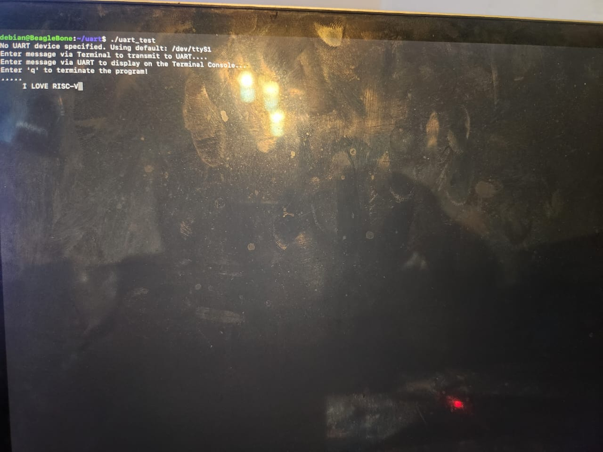
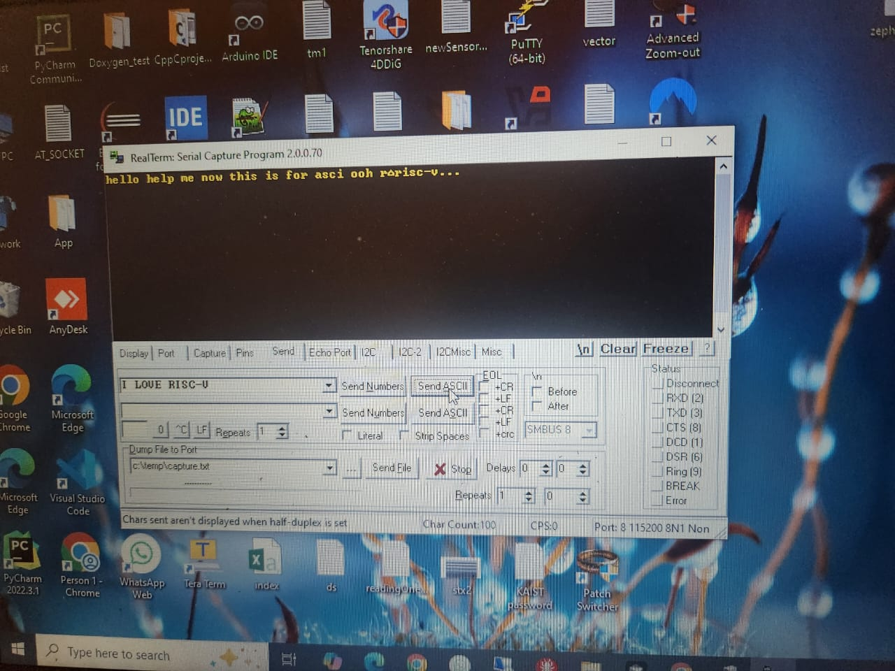
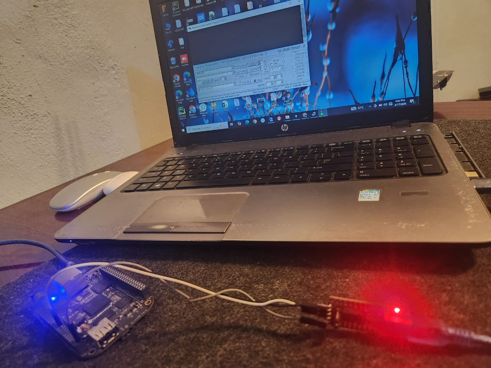
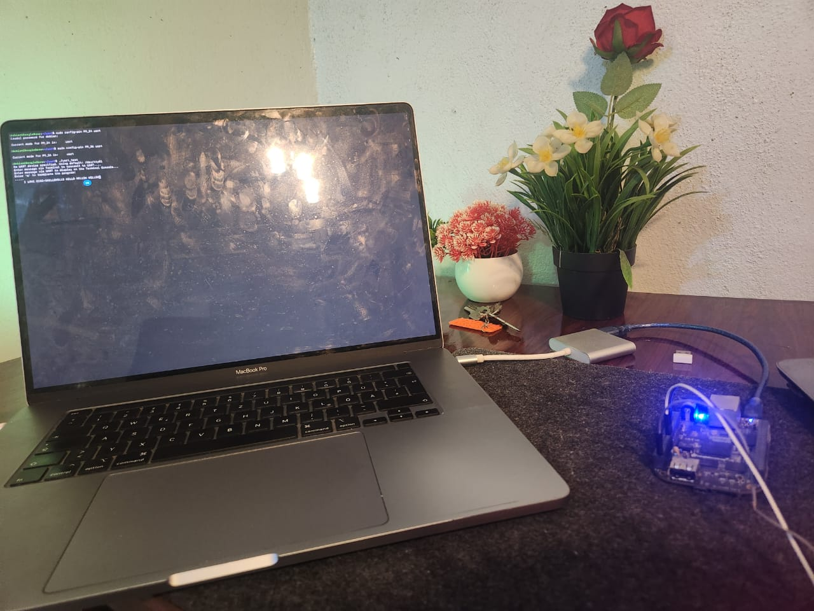

# UART Communication with BeagleBone Black

## Overview

This project demonstrates bidirectional UART communication between a BeagleBone Black (BBB) and a Windows PC using an FTDI USB-to-Serial adapter.

* Data sent from the BBB terminal → displayed on Windows via RealTerm
* Data sent from RealTerm → displayed on the BBB terminal


## Hardware Setup

### Components

- BeagleBone Black (BBB)
- FTDI USB-to-Serial Adapter
- Windows PC (with RealTerm)
- Mac (used to SSH into BBB)

### UART Connections (BBB UART1)

| BeagleBone Black Pin | Function | Connect to FTDI |
| -------------------- | -------- | --------------- |
| P9_24                | UART1 TX | FTDI RX         |
| P9_26                | UART1 RX | FTDI TX         |
| GND                  | Ground   | GND             |

Ensure **cross-connection**:

- TX -> RX
- RX -> TX


## Software Setup
### 1. Verify UART availability

On the BeagleBone Black:
```bash
dmesg | grep tty
```

Expected output should include something like:
```bash
ttyS1 at MMIO ...
```
This confirms UART is enabled in the kernel.


### 2. Verify pin configuration

Check current pin mode:
```bash
config-pin -q P9_24
config-pin -q P9_26
```

Example output:
```
Current mode for P9_24 is: default
Current mode for P9_26 is: default
```


### 3. Set pins to UART mode
```bash
sudo config-pin P9_24 uart
sudo config-pin P9_26 uart
```

Verify again:
```
Current mode for P9_24 is: uart
Current mode for P9_26 is: uart
```


### Important Note

- `config-pin` changes are **NOT persistent across reboot**
- You must rerun the commands after each reboot


## Build Instructions

On the BeagleBone Black:
```bash
gcc -o uart_test uart_test.c
```


## Run Instructions
```bash
./uart_test
```
This command uses the default UART device (/dev/ttyS1)

Or specify the UART device manually:
```bash
./uart_test /dev/ttyS1
```


## RealTerm Configuration (Windows PC)

- Baud rate: 115200
- Data bits: 8
- Parity: None
- Stop bits: 1
- Port: (Check FTDI COM port in Device Manager)


## Usage
- Type in BBB terminal → appears in RealTerm
- Type in RealTerm → appears in BBB terminal
- Press `q` in the BBB terminal to exit


## Communication Flow

```
BBB (UART1) ───> FTDI ───> Windows (RealTerm)
BBB (Terminal) <─── FTDI <─── Windows (RealTerm)
```


## Notes

* Uses `/dev/ttyS1` (UART1) instead of `/dev/ttyS0` (reserved for console)
* Uses non-blocking I/O for continuous communication
* Requires proper pin multiplexing via `config-pin`


## Images





